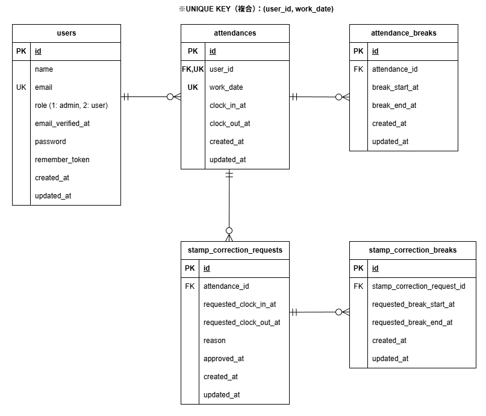

# Attendance Management App

## アプリ概要
本アプリは、一般ユーザーの勤怠打刻および勤怠修正申請、管理者による勤怠確認・修正・申請承認ができる勤怠管理アプリです。

一般ユーザーは、出勤・退勤・休憩の打刻、勤怠一覧の確認、勤怠修正申請を行うことができます。  
管理者は、当日の勤怠一覧確認、スタッフ別勤怠一覧確認、勤怠詳細の修正、修正申請の承認を行うことができます。

---

## 主な機能

### 一般ユーザー
- 会員登録
- ログイン / ログアウト
- メール認証
- 出勤打刻
- 休憩開始 / 休憩終了
- 退勤打刻
- 勤怠一覧表示
- 勤怠詳細表示
- 勤怠修正申請
- 修正申請一覧表示

### 管理者
- ログイン / ログアウト
- 当日の勤怠一覧表示
- 勤怠詳細表示 / 勤怠修正
- スタッフ一覧表示
- スタッフ別勤怠一覧表示
- 修正申請一覧表示
- 修正申請承認

---

## 使用技術（実行環境）
- PHP 8.1.34
- Laravel 8.83.29
- MySQL 8.0.26
- nginx 1.21.1
- JavaScript（Vanilla JS）
- Docker / Docker Compose
- HTML / CSS（Bladeテンプレート）

## 開発・テスト・外部サービス
- PHPUnit
- MailHog

---

## 環境構築

※ 以下のコマンドは、すべてホスト側のターミナルでプロジェクトルートから実行してください。

### Dockerビルド
1. リポジトリをクローン
```bash
git clone https://github.com/yakhrc5/attendance_management_app.git
```

2. 作業ディレクトリに移動
```bash
cd attendance_management_app
```

3. Docker Desktopを起動
4. Dockerコンテナをビルドして起動
```bash
docker compose up -d --build
```

### Laravel環境構築
1. パッケージをインストール
```bash
docker compose exec php composer install
```

2.  `.env` ファイルを作成
```bash
cp src/.env.example src/.env
```

3. アプリケーションキーの作成
``` bash
docker compose exec php php artisan key:generate
```

4. マイグレーション・シーディングを実行
``` bash
docker compose exec php php artisan migrate --seed
```

5. storage / bootstrap/cache の権限を設定
```bash
docker compose exec php chown -R www-data:www-data /var/www/storage /var/www/bootstrap/cache
docker compose exec php chmod -R 775 /var/www/storage /var/www/bootstrap/cache
```

## アクセスURL
- 開発環境: http://localhost/
- 一般ユーザーログイン: http://localhost/login
- 管理者ログイン: http://localhost/admin/login
- phpMyAdmin: http://localhost:8080/
- MailHog: http://localhost:8025/

---

## ログイン情報

### 管理者
以下のユーザーでログインできます。

| 名前 | メールアドレス | パスワード |
| --- | --- | --- |
| 管理者 | `admin@example.com` | `password123` |

※ 上記管理者はシーディングで登録されます。

### 一般ユーザー
以下のユーザーでログインできます。

| 名前 | メールアドレス | パスワード |
| --- | --- | --- |
| 山田 太郎 | `user1@example.com` | `password123` |
| 佐藤 花子 | `user2@example.com` | `password123` |

※ 上記ユーザーはシーディングで登録されます。  
※ 一般ユーザーで新規登録した場合は、メール認証後にログインできます。

---

## テスト環境構築
テスト実行時は `.env.testing` の設定を使用します。
テスト用データベースとして `attendance_testing` を利用します。

1. `.env.testing` ファイルを作成
```bash
cp src/.env.testing.example src/.env.testing
```

2. テスト用データベースを作成
```bash
docker compose exec mysql mysql -uroot -proot -e "CREATE DATABASE IF NOT EXISTS attendance_testing;"
```

3. テスト用アプリケーションキーの作成
``` bash
docker compose exec php php artisan key:generate --env=testing
```

4. テストの実行
``` bash
docker compose exec php php artisan test
```

---

## ER図

